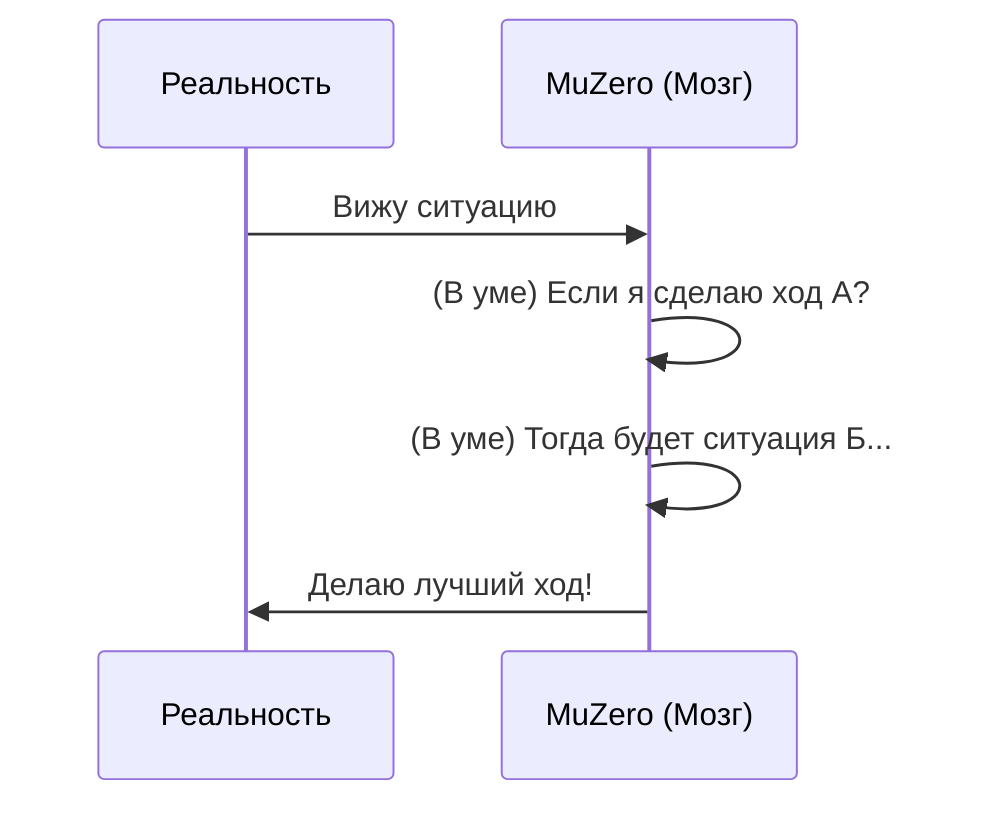
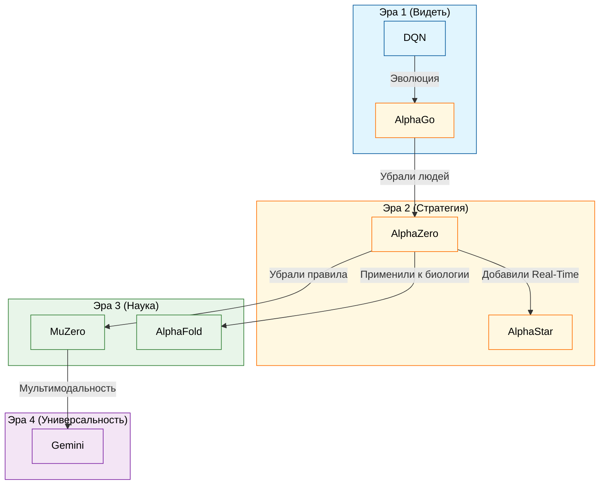

# The Evolution of Google DeepMind: A Hierarchical History
## From Playing Atari to Solving Science

Этот документ — ваш путеводитель по истории искусственного интеллекта от DeepMind. Мы разбили все модели на **эры**, чтобы показать, как ИИ прошел путь от простого игрока до ученого.

---

## 🏛 Эра 1: Обучение Видеть и Играть (2013–2015)
**Цель:** Научить ИИ понимать картинку с экрана и принимать решения.
**Главный прорыв:** DQN.

### 1. DQN (Deep Q-Network)
*   **Простыми словами:** Первый ИИ, который научился играть в видеоигры (Atari) лучше человека, просто глядя на пиксели. До этого никто не верил, что нейросеть может учиться так же, как человек.
*   **Как работает:** Видит экран -> Оценивает полезность действий -> Получает очки -> Учится.
*   **Вклад:** Доказал, что Deep Learning + Reinforcement Learning работают вместе.

```mermaid
graph LR
    Screen[Экран игры] --> NeuralNet[Нейросеть (Мозг)]
    NeuralNet --> Action[Действие: Прыжок/Выстрел]
    Action --> Score[Счет +10]
    Score -.->|Обучение| NeuralNet
```

---

## ♟ Эра 2: Стратегия и Доминирование (2016–2019)
**Цель:** Победить человека в самых сложных интеллектуальных играх.
**Главный прорыв:** AlphaGo и AlphaZero.

### 2. AlphaGo
*   **Простыми словами:** ИИ, победивший чемпиона мира по игре Го. Это считалось невозможным, так как в Го вариантов ходов больше, чем атомов во Вселенной.
*   **Секрет:** Сочетал "интуицию" (нейросети) с "расчетом" (поиск по дереву MCTS). Учился, изучая партии людей.

### 3. AlphaGo Zero / AlphaZero
*   **Простыми словами:** Эта версия **отказалась от человеческого опыта**. Она училась играть, играя сама с собой 40 дней подряд.
*   **Результат:** Уничтожила AlphaGo (счет 100:0) и научилась играть в Шахматы и Сёги за 4 часа.

### 4. AlphaStar
*   **Простыми словами:** Профессиональный игрок в StarCraft II. В отличие от шахмат, здесь нужно видеть карту, управлять армией в реальном времени и блефовать.
*   **Секрет:** Использовал сложную архитектуру с памятью (Transformer пришел в RL) и "Лигу Агентов", где разные версии ИИ учились побеждать друг друга.

---

## 🧬 Эра 3: Наука и Реальный Мир (2020–2021)
**Цель:** Решать задачи, которые не могут решить ученые.
**Главный прорыв:** AlphaFold и MuZero.

### 5. AlphaFold 2
*   **Простыми словами:** "Святой Грааль" биологии. Предсказывает 3D-структуру белка по его ДНК-коду. Раньше на это уходили годы работы в лаборатории, AlphaFold делает это за минуты.
*   **Вклад:** Ускорил создание лекарств и понимание болезней.

### 6. MuZero
*   **Простыми словами:** ИИ, который учится планировать, не зная правил. Работает в шахматах, Atari и даже сжимает видео на YouTube.
*   **Секрет:** Не пытается предсказать картинку доски, а предсказывает "суть" ситуации (скрытые векторы).



---

## 🤖 Эра 4: Универсальный Интеллект (2022–Сегодня)
**Цель:** Один ИИ для всего (General Intelligence).
**Главный прорыв:** Gato и Gemini.

### 7. Gato
*   **Простыми словами:** "Швейцарский нож". Одна и та же нейросеть может играть в игры, подписывать картинки, управлять роборукой и чатиться.
*   **Секрет:** Превращает всё (картинки, текст, действия робота) в токены и учится предсказывать следующий шаг.

### 8. Gemini
*   **Простыми словами:** Самая мощная мультимодальная модель. Видит, слышит, читает и пишет код одновременно.
*   **Эволюция:** Это наследник AlphaGo и трансформеров. Она использует поисковые алгоритмы (как в AlphaGo) для решения логических и математических задач.

---

## Итоговая Иерархия (Диаграмма)



## Как стать Senior ML Engineer, зная это?
1.  **DQN** научит вас основам RL (Q-Learning).
2.  **AlphaZero** научит вас силе **Self-Play** (игра с самим собой).
3.  **MuZero** покажет, как работать без идеального симулятора (**Model-Based RL**).
4.  **AlphaFold** покажет, как применять ИИ в **Science** (Graph Networks).
5.  **Gemini** — это будущее: **Multimodal LLM**.
