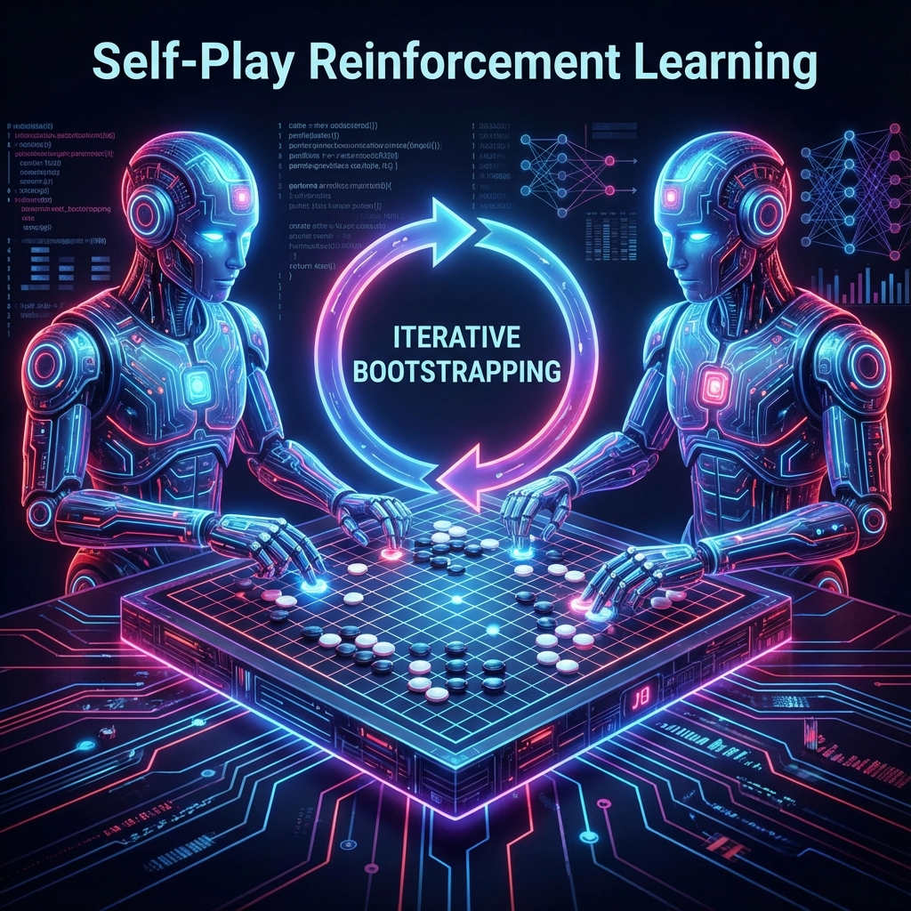

# Обучение с подкреплением через самовоспроизведение (Self-Play RL)

### Коротко: что это и зачем нужно
Это способ обучения ИИ, при котором агент играет сам с собой. Это позволяет ему бесконечно совершенствоваться, не нуждаясь в человеческих данных или подсказках.

### Суть идеи
Вместо того чтобы учить ИИ на партиях гроссмейстеров, мы заставляем две копии одной и той же нейросети соревноваться друг с другом. Тот, кто выигрывает, становится «учителем» для следующей итерации. Это создает цикл бесконечного роста сложности и мастерства.

### Алгоритм действий
1. **Инициализация**: Создается нейросеть со случайными весами.
2. **Дуэль**: Сеть играет миллионы партий против своих предыдущих версий.
3. **Отбор**: Из более успешных партий формируются данные для обучения.
4. **Обновление**: Нейросеть обучается на этих данных и становится сильнее.
5. **Повторение**: Новая, более сильная версия снова начинает играть сама с собой.

### Практический пример
**AlphaGo Zero**. В отличие от первой AlphaGo, версия Zero не видела ни одной партии человека. Через 3 дня игры самой с собой она победила оригинальную AlphaGo со счетом 100:0.

### Код (псевдокод процесса)
```python
while model_strength < target:
    experience = self_play(current_model)
    new_model = train(current_model, experience)
    if evaluate(new_model, current_model) > win_rate_threshold:
        current_model = new_model
```

### Советы и ошибки
- **Ошибка**: Играть только с текущей версией (может привести к «зацикливанию» на одной слабой стратегии).
- **Совет**: Сохраняйте архив старых версий и иногда играйте против них, чтобы проверять общую устойчивость.


