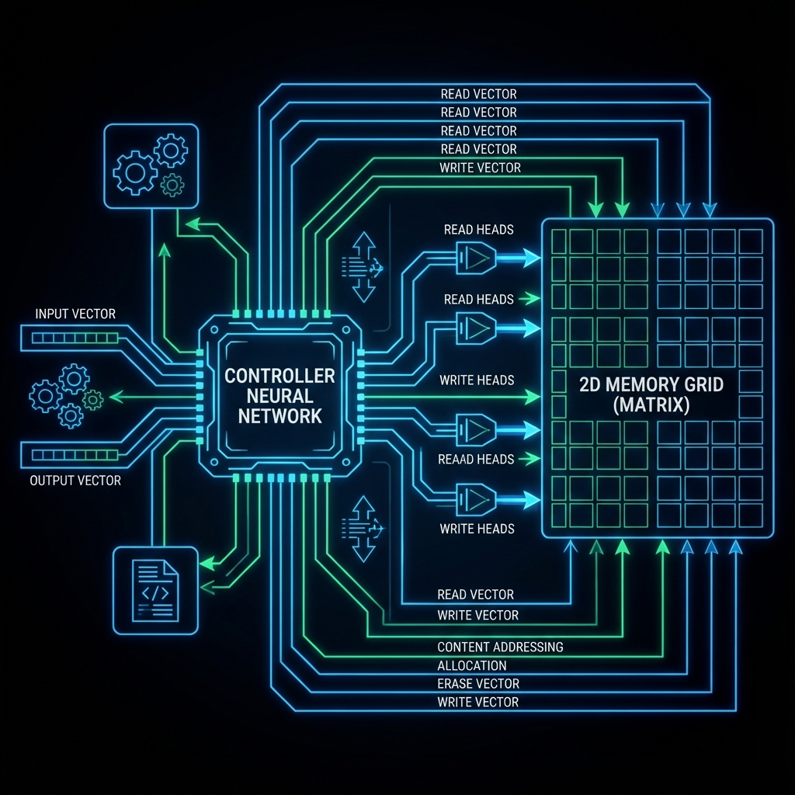

# Дифференцируемые сети с внешней памятью (DNC)

### Коротко: что это и зачем нужно
DNC (Differentiable Neural Computer) — это нейросеть, у которой есть «внешний жесткий диск» (массив памяти). Это позволяет ИИ решать сложные алгоритмические задачи, требующие запоминания структурированных данных.

### Суть идеи
Обычные нейросети хранят знания в своих «весах» (связях). DNC же умеет записывать данные в отдельную таблицу памяти и считывать их оттуда. Главная фишка в слове «дифференцируемые»: процессы чтения и записи описываются математически так, что нейросеть может сама научиться пользоваться этой памятью через градиентный спуск.

### Алгоритм действий
1. **Контроллер**: Нейросеть-управленец получает входные данные.
2. **Запись**: Контроллер решает, в какую ячейку памяти записать важную информацию.
3. **Хранение**: Данные лежат в матрице памяти.
4. **Чтение**: Когда нужно решить задачу, контроллер находит нужные данные в памяти (по ассоциациям или адресу).
5. **Вывод**: Объединение входных данных и данных из памяти для финального ответа.

### Практический пример
Поиск кратчайшего пути в лондонском метро. DNC может «запомнить» карту графа и эффективно перемещаться по ней, в то время как обычные сети быстро путаются в сложных связях.

### Пример архитектуры
Контроллер (LSTM) $\leftrightarrow$ Головки чтения/записи $\leftrightarrow$ Матрица памяти $M$.

### Советы и ошибки
- **Ошибка**: Слишком маленькая память для сложной структуры данных.
- **Совет**: Используйте DNC, если ваша задача напоминает программирование (сортировка, поиск путей, логические выводы), а не просто классификацию картинок.

