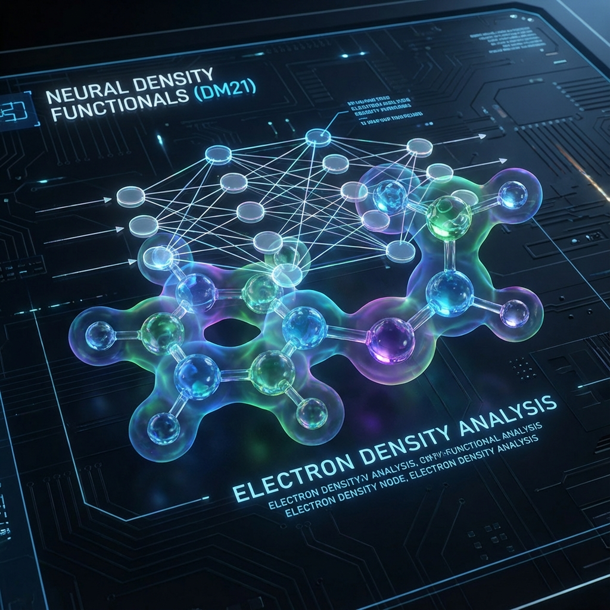

# Нейронные функционалы плотности в науке (DM21)

### Коротко: что это и зачем нужно
DeepMind применил машинное обучение к квантовой химии. Проект DM21 решает уравнение Шредингера более точно и быстро, чем традиционные физические методы.

### Суть идеи
В квантовой химии важно знать плотность электронов в молекуле. Старые методы (DFT) часто ошибались в сложных случаях. DeepMind обучил нейросеть аппроксимировать функционал плотности, используя точные данные для малых систем. Это позволило ИИ «понять» законы квантового мира.

### Алгоритм действий
1. **Генерация данных**: Точные расчеты для простых атомов и молекул.
2. **Обучение сети**: Обучение модели предсказывать энергию и распределение заряда.
3. **Валидация**: Проверка на сложных молекулах (например, этане или белках).
4. **Применение**: Использование модели для поиска новых материалов или лекарств.

### Практический пример
**AlphaFold** и **DM21**. Эти системы позволяют ученым моделировать биологические и химические процессы в компьютере, экономя годы лабораторных исследований.

### Зачем это нужно бизнесу?
- Ускорение разработки новых аккумуляторов.
- Создание сверхпрочных материалов.
- Проектирование новых лекарственных соединений.

### Советы и ошибки
- **Ошибка**: Полное доверие ИИ без проверки физических констант.
- **Совет**: ИИ в науке — это супер-инструмент для сужения области поиска, но финальный результат должен подтверждаться экспериментом.

