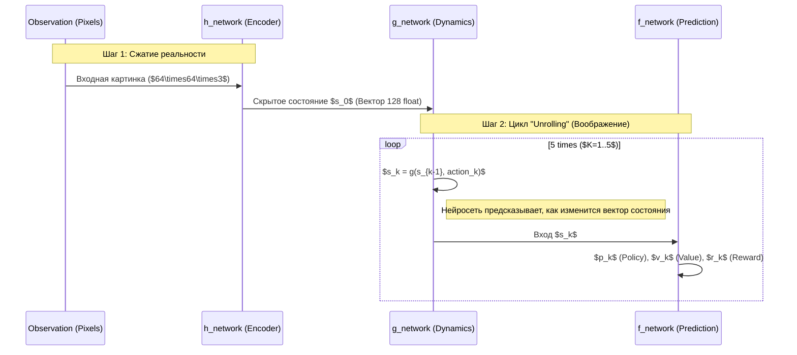

# Architecture of World Models: A Senior Engineer's Deep Dive
## From Junior Data Engineer to Senior ML Architect

Этот документ переработан для уровня **Senior ML Engineer**. Мы уйдем от простых определений и разберем **инженерную мотивацию**, **математическую интуицию** и **скрытые механизмы**, которые делают эти системы возможными.

---

## 1. Фундаментальная проблема: Почему Google DeepMind вообще это создали?

Как Junior Engineer, вы привыкли работать с данными, которые *уже есть*. В ML это называется **Supervised Learning** (с учителем). Но реальный мир не дает размеченных данных.

**Проблема 1: Sample Inefficiency (Дороговизна данных)**
Чтобы научить робота ходить с помощью классического RL (как DQN), робот должен упасть 10 миллионов раз. В симуляции это ок, но в реальности робот сломается через 100 падений.
*Решение:* **DreamerV3**. Позволяет роботу "мечтать" (симулировать падения в голове), не ломая себя. Google создал это для **робототехники и управления дата-центрами**.

**Проблема 2: The "Unknown Rules" Problem (Неизвестные правила)**
AlphaGo знал правила Го. Но в реальной жизни (например, управлении трафиком YouTube) никто не знает "правил игры" — как именно поведение одного пользователя повлияет на сервер через 5 минут. Попытка написать `if-else` правила провалится.
*Решение:* **MuZero**. Он не требует правил. Он *учит* правила сам, наблюдая за динамикой.

---

## 2. Глубокий разбор MuZero: Инженерия Предсказаний

### Архитектура "Unrolling" (Развертывание во времени)
Для Senior инженера MuZero — это не просто дерево поиска. Это **Rekurrent Latent Transition Engine**.

#### Как это работает "под капотом"?
Рассмотрим процесс на примере шага $K=5$ (планирование на 5 шагов вперед).



### Инженерный инсайт: Почему это гениально?
Обычные модели пытаются предсказать **следующий кадр** (видео). Это безумно сложно — предсказывать каждый пиксель листвы на дереве, когда машина едет.
**MuZero игнорирует пиксели в будущем.** Он предсказывает только *скрытый вектор*, который содержит информацию о *ценности*.
*Пример:* Ему не важно, какого цвета машина, которая в вас врежется. Ему важно только то, что столкновение = минус награда. Это экономит 99% вычислений.

---

## 3. Глубокий разбор DreamerV3: Математика Воображения

### Latent Dynamics и RSSM (Recurrent State Space Model)
DreamerV3 использует архитектуру, похожую на VAE (Variational Autoencoder) + RNN. Это сердце "мировой модели".

#### Механизм RSSM
RSSM (Recurrent State Space Model) разделяет состояние на две части:
1.  **Deterministic (Детерминированная)**: Память (RNN). Помнит контекст ("Я разогнался, значит, буду ехать быстро").
2.  **Stochastic (Стохастическая)**: Случайность (VAE). Учитывает неопределенность ("Может, выскочит пешеход, а может нет").

```mermaid
graph LR
    subgraph World Model
    h["h_t: Deterministic Path (RNN)"] -->|Контекст| s["z_t: Stochastic State"]
    x["x_t: Observation"] -->|Encoder| s
    s -->|"Decoder (для обучения)"| x_recon[Восстановленная картинка]
    end
    
    subgraph Imagination (Actor-Critic)
    s -.->|Генерация траекторий| s_future["z_{t+1}...z_{t+H}"]
    s_future --> Actor[Actor Network]
    s_future --> Critic[Critic Network]
    end
    
    style World Model fill:#1f2937,stroke:#3b82f6,stroke-width:2px
    style Imagination fill:#1f2937,stroke:#10b981,stroke-width:2px
```

### Senior Engineering Challenge: "Objective Collapse"
Если модель учится "воображать", она может начать "халявить": придумать мир, где она всегда побеждает и получает кучу наград, игнорируя реальность.
**Решение в DreamerV3:** KL-Balancing. Мы математически штрафуем модель, если ее "фантазии" ($z_{predicted}$) слишком сильно отличаются от того, что она видит в реальности ($z_{posterior}$).

$$L_{model} = L_{reconstruction} + \beta \cdot KL(Posterior || Prior)$$

---

## 4. Сравнение парадигм для Senior Architect

Если вы выбираете архитектуру для продакшена:

| Feature | **MuZero** | **DreamerV3** |
| :--- | :--- | :--- |
| **Best for...** | Задач с четким "выигрышем" и сложной тактикой (Логистика, Игры, Трейдинг). | Задач с непрерывной физикой и дорогим сбором данных (Роботы, Автопилоты, Дроны). |
| **Inference Latency** | **Высокая**. Нужно запускать MCTS (много прогонов сети) перед каждым действием. | **Низкая**. Агент просто прогоняет одну маленькую сеть (Policy). "Думает" он во время обучения (ночью). |
| **Engineering Cost** | Требует мощных CPU/TPU для параллельного поиска MCTS. | Требует GPU с большой памятью для хранения "резервуара опыта" и градиентов RSSM. |

---

## 5. Реальные примеры (Beyond Games)

### 1. YouTube Video Compression (MuZero-like)
**Задача:** Как сжать видео максимально сильно, но чтобы качество не упало?
**MuZero подход:**
- *State:* Текущий буфер видео.
- *Action:* Выбор параметров кодека (битрейт, квантование).
- *Reward:* Качество картинки (VMAF) минус размер файла.
MuZero "планирует" кодирование, предсказывая, как настройки повлияют на кадры через 5 секунд.

### 2. Google Data Center Cooling (Dreamer-like)
**Задача:** Охладить серверы, тратя минимум электричества.
**Dreamer подход:**
- *World Model:* Выучивает физику термодинамики дата-центра. "Если я включу вентилятор на 100%, температура упадет через 2 минуты, но расход энергии вырастет сразу".
- *Imagination:* Система прогоняет миллионы сценариев охлаждения в виртуальной модели.
- *Action:* Применяет лучшую стратегию в реальности. Результат: экономия 40% энергии.

---

## 6. Ваш путь к Senior ML Engineer

Чтобы стать Senior-ом в этой области:
1.  **Перестаньте думать "датасетами"**. Начните думать **"окружениями" (Environments)**.
2.  **Изучите MLOps для RL**: Как версионировать не только код, но и "опыт" (Replay Buffer)? Как дебажить модель, которая сама придумывает себе данные?
3.  **Поймите Latent Spaces**: Вся магия происходит не в пикселях, а в векторах. Научитесь визуализировать скрытые состояния (t-SNE, PCA), чтобы понять, "о чем думает" ваша модель.
