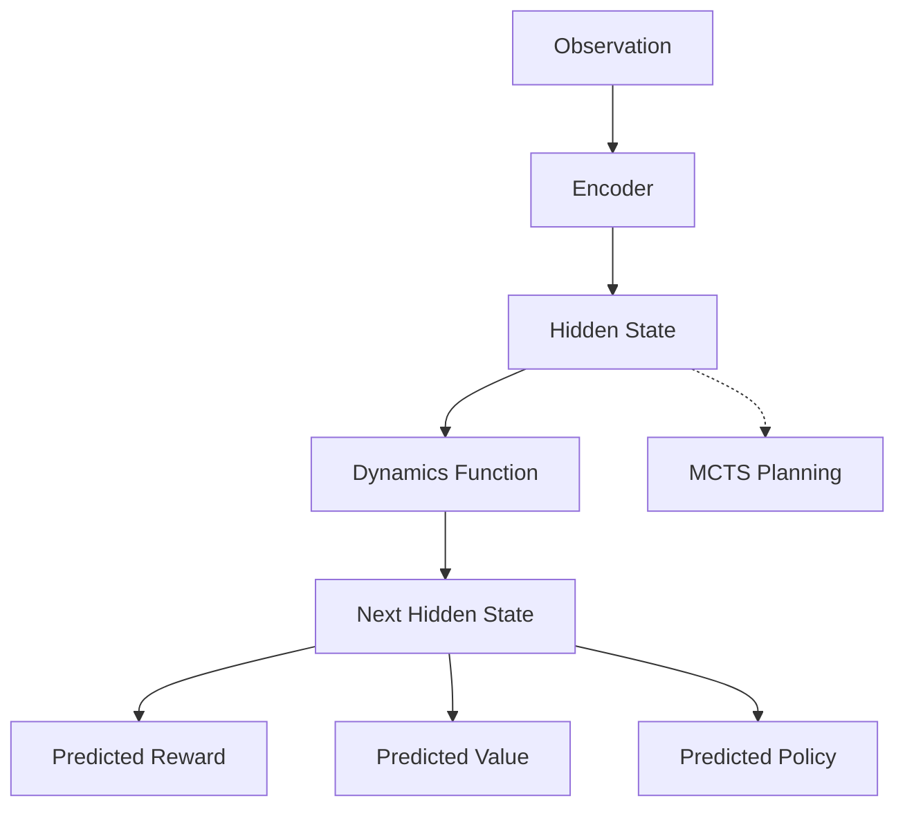
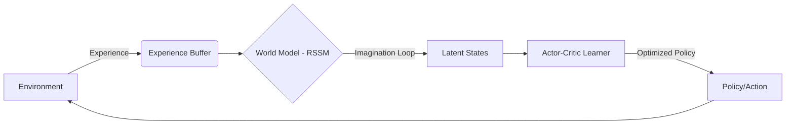

# Парадигмы машинного обучения как программные архитектуры: Анализ MuZero и DreamerV3

## 1. Определение "Паттерна машинного обучения" в контексте продвинутых программных парадигм

### Отличие от объектно-ориентированных паттернов (GoF)
Традиционные паттерны проектирования (как Singleton, Strategy или Observer) описывают **статическую структуру** и **взаимодействие типов** (классов/объектов), где логика управления прописана явно.

**Паттерн машинного обучения (ML Pattern)** — это архитектурная парадигма, где:
- **Управление через оптимизацию**: Вместо явных условий `if-else` или полиморфизма, поведение системы определяется минимизацией функции потерь (Loss Function) или максимизацией награды.
- **Обучаемые абстракции**: Вместо жестко заданных интерфейсов, система создает динамические представления (Representations) данных.
- **Feedback-Loop как Core Engine**: Цикл обратной связи (Experience Collector → Learner → Actor) заменяет линейное выполнение кода.

## 2. Анализ систем: MuZero и DreamerV3

### А) MuZero: Парадигма Планирования в Скрытом Пространстве
**Core Pattern**: *Dynamics-based Predictive Planning*.

- **Execution Model**: Система работает в двух режимах: **Обучение** (имитация прошлого опыта) и **Активное действие** (поиск по дереву MCTS внутри изученной модели).
- **Dataflow**: `Observation` → `Encoder` (скрытое состояние) → `MCTS-Planning` (итеративное предсказание будущего внутри модели) → `Action`.
- **Optimization vs Logic**: Логика игры (шахматы, го) не закодирована. Она заменена на функцию динамики $g_\theta$, которая предсказывает следующее скрытое состояние и награду.

### Б) DreamerV3: Парадигма Латентного Воображения (Latent Imagination)
**Core Pattern**: *Generalist World Model Learning*.

- **Execution Model**: DreamerV3 учится полностью внутри «воображения». Система предсказывает будущее на много шагов вперед в латентном пространстве, не обращаясь к реальной среде во время оптимизации политики.
- **Dataflow**: `Experience` → `RSSM` (World Model) → `Latent Imagination` (генерация виртуальных траекторий) → `Policy Learning` (Actor-Critic) → `Action`.
- **Asymmetry**: Огромная асимметрия между сбором данных и обучением. Обучение происходит на порядки чаще, используя "воображаемый" опыт.

## 3. Сравнение архитектурных решений

Обе системы представляют одну парадигму — **World Model Learning**, но различаются в реализации:

| Характеристика | MuZero (Символьное планирование) | DreamerV3 (Латентное воображение) |
|:---:|:---|:---|
| **Механизм решения** | Monte Carlo Tree Search (MCTS) | Латентное воображение + Actor-Critic |
| **Представление будущего** | Дискретные ветки поиска | Непрерывный поток латентных состояний |
| **Универсальность** | Идеален для дискретных сред (игры) | Масштабируется на любые пространства действий |
| **Надежность** | Высокая точность, но дорогой поиск | Стабильность за счет фиксированных параметров Loss |

## 4. Связь с продвинутыми программными парадигмами

1. **Agent–Environment Interaction**: Программа перестает быть изолированным исполнителем и становится адаптивным агентом, чье состояние зависит от динамического окружения.
2. **Predictive Execution**: Исполнение кода основано на вероятностном прогнозе (Exploration), а не на детерминированном пути.
3. **Event Loops vs Imagination Loops**: Традиционный Event Loop обрабатывает реальные сигналы; Imagination Loop обрабатывает сгенерированные моделью события для предсказания рисков.

## 5. Критическая оценка

- **Сильные стороны**: Способность решать задачи без внешних правил; высокая эффективность использования данных (Sample Efficiency).
- **Ограничения**: Вычислительная сложность обучения; "хрупкость" модели мира (если модель ошибается, агент принимает неверные решения).
- **Production Challenge**: Сложность отладки. Невозможно поставить Breakpoint в "нейронную логику" и понять, почему агент выбрал конкретное действие.

## 6. Применение в реальном мире

- **Finance**: Прогнозирование кредитных рисков и мошенничества. World Model позволяет "проигрывать" сценарии поведения клиента в будущем, учитывая отложенные последствия его трат.
- **Robotics**: Планирование траекторий в неизвестных пространствах. Робот "воображает" возможные столкновения до того, как они произойдут в реальности.
