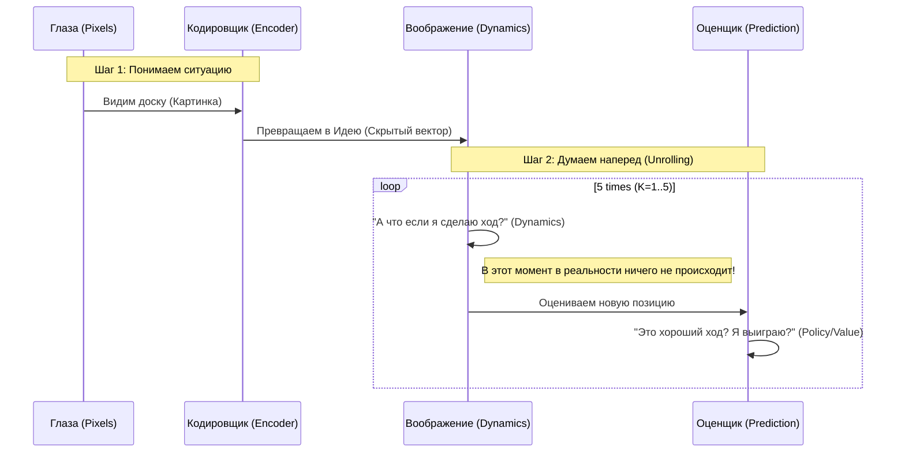

# World Models Explained: Deep Tech in Simple Words
## From Junior to Senior: Understanding the "Brain" of Modern AI

Вы просили объяснить сложное простыми словами. Давайте разберем **MuZero** и **DreamerV3** так, чтобы это понял и новичок, и опытный инженер. Мы сохраним диаграммы (потому что Senior обязан читать схемы), но объясним их на пальцах.

---

## 1. Главная проблема: Зачем вообще нужны эти "Модели Мира"?

Представьте, что вы учитесь кататься на велосипеде.
*   **Обычный RL (как DQN)**: Вы садитесь на велосипед, падаете, встаете, снова падаете. Чтобы научиться, вам нужно упасть 10,000 раз. В жизни это больно и дорого.
*   **World Models (Модели Мира)**: Вы *закрываете глаза* и представляете, как едете. Вы "падаете" в своем воображении, понимаете ошибку, и в реальности едете уже правильно.

**Суть для Senior Engineer**:
Мы заменяем **дорогие данные** из реальности на **дешевые данные** из воображения (симуляции).

---

## 2. MuZero: Шахматист в вашей голове

**Аналогия**: Представьте гроссмейстера, который думает над ходом. Он не двигает фигуры на доске (в реальности). Он двигает их *в уме*.
*   "Если я пойду конем сюда, он съест пешку..." — это и есть **MuZero**.

### Как это работает (Разбор диаграммы)

Смотрите на схему ниже. Это "мозг" MuZero.

**Простыми словами:**
1.  **Encoder (Кодировщик)**: Превращает сложную картинку (пиксели) в абстрактную "Идею ситуации" (вектор). Гроссмейстер не помнит цвет доски, он помнит *позицию*.
2.  **Dynamics (Динамика)**: Это функция "А что если?". Она предсказывает, как изменится "Идея ситуации", если сделать ход.
3.  **Prediction (Оценщик)**: Говорит, хорошо это или плохо.

**Почему это круто (Senior Insight)**:
MuZero *не пытается* представить картинку будущей доски. Это сложно и не нужно. Он работает только с *сутью* (векторами). Это позволяет ему планировать стратегии там, где мы даже правил не знаем (например, сжатие видео на YouTube).

---

## 3. DreamerV3: Авиасимулятор во сне

**Аналогия**: Пилот учится летать не на настоящем Боинге, а на тренажере. DreamerV3 — это ИИ, который *сам строит себе тренажер* и учится в нем.

### Схема "Сна" (Dreaming)

```mermaid
graph LR
    subgraph WM ["World Model (Тренажер)"]
    h["Память (RNN)"] -->|Помню прошлое| s["Ситуация (State)"]
    x["Реальность (Obs)"] -->|Вижу сейчас| s
    end
    
    subgraph IM ["Imagination (Обучение)"]
    s -.->|Мечтаем| s_future["Воображаемое будущее..."]
    s_future --> Actor["Пилот (Actor)"]
    s_future --> Critic["Тренер (Critic)"]
    end
    
    style WM fill:#1f2937,stroke:#3b82f6,stroke-width:2px
    style IM fill:#1f2937,stroke:#10b981,stroke-width:2px
```

**Простыми словами:**
1.  **World Model (Тренажер)**: Пока робот ходит, он запоминает: "Если нажать газ, стена приближается". Так он строит модель физики мира.
2.  **Imagination (Обучение)**: Ночью (или в паузах) робот "спит". В этом сне он гоняет миллионы виртуальных ситуаций: "А если я разгонюсь и поверну?".
3.  **Actor (Пилот)**: Учится управлять на этих снах. В реальности он просто использует навыки, полученные во сне.

**Почему это круто (Senior Insight)**:
В MuZero мы планируем *перед каждым ходом* (долго думаем). В Dreamer мы *выучили инстинкты* заранее. Поэтому Dreamer реагирует мгновенно. Это идеально для роботов и автопилотов.

---

## 4. Сравнение: Что выбрать?

Как Senior Engineer, вы должны выбирать инструмент под задачу.

| Если ваша задача... | Используйте **MuZero** (Шахматист) | Используйте **Dreamer** (Пилот) |
| :--- | :--- | :--- |
| **Пример** | Логистика, Трейдинг, Игры (Go, Chess) | Роботы, Дроны, Управление дата-центром |
| **Суть** | Нужно *точно рассчитать* лучший ход здесь и сейчас. | Нужно *быстро реагировать* на меняющуюся ситуацию. |
| **Цена** | "Дорого" думать во время работы (нужен мощный сервер). | "Дешево" работать, но долго учиться (нужна мощная видеокарта для обучения). |

---

## 5. Итог: Что нужно запомнить Senior-у

1.  **Не учитесь на ошибках в реальности**. Это дорого. Учите модель мира и ошибайтесь в ней.
2.  **Скрытое пространство (Latent Space)** — это главное. Не пытайтесь предсказывать пиксели или погоду по атомам. Предсказывайте *суть* (векторы).
3.  **MuZero думает ("Plan")**. **Dreamer мечтает ("Imagine")**. Это разные подходы к одной цели — заглянуть в будущее.
